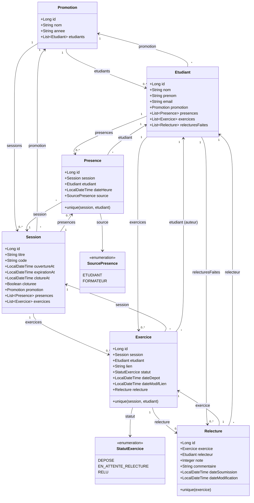

# D2 — Modèle de données (classes / entités)

**Correspondance migrations Flyway (à venir) :**
- `V1__create_schema.sql` : tables `promotion`, `etudiant`, `session`, `presence`, `exercice`, `relecture`
- `V2__add_indexes_constraints.sql` : indexes sur code, unicités, FK
- `V3__insert_demo_data.sql` : 1 promotion, 5 étudiants, 1 session ouverte

**Règles de gestion mappées :**
- RG1 : `Session.expirationAt = ouvertureAt + 15 min`
- RG2 : `Relecture.relecteur != Exercice.etudiant` (contrainte applicative)
- RG3 : `Relecture.note` CHECK (0-20)
- RG4 : `Relecture` unique sur `exercice_id`
- RG5 : Assignation via requête `Etudiant` présent à la `Session`
- RG6 : `Presence` unique sur `(session_id, etudiant_id)`
- RG7 : `Exercice` unique sur `(session_id, etudiant_id)`
- RG11 : `Presence.source` = FORMATEUR pour présence manuelle
- RG16 : `Exercice.statut = EN_ATTENTE_RELECTURE` si pas de relecture