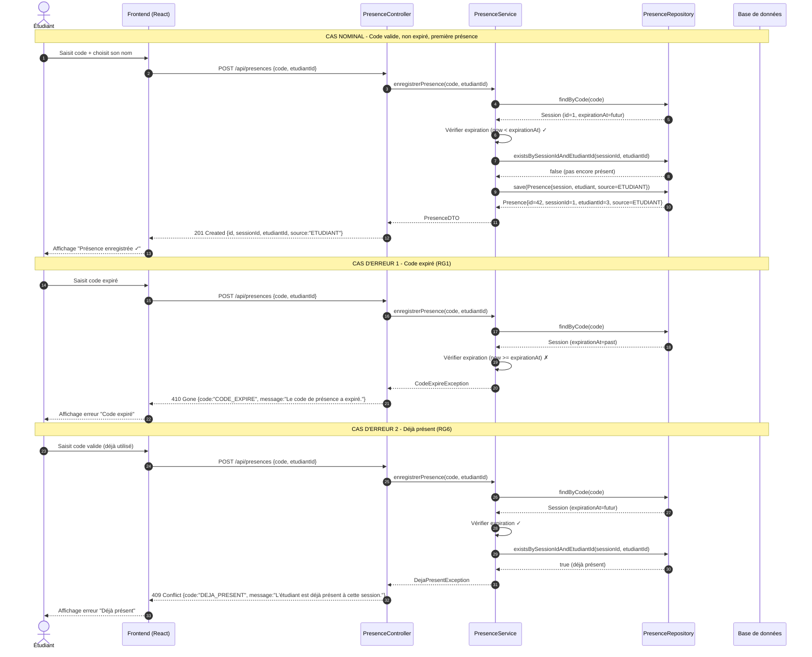

# D3 — Séquence : Marquer sa présence

**Codes HTTP conformes au contrat imposé (`api/contrat.yaml`) :**
| Cas | Code HTTP | Code erreur | Message |
|-----|-----------|-------------|---------|
| Nominal | 201 | — | — |
| Code inconnu | 400 | `CODE_INCONNU` | "Code de présence inconnu." |
| **Code expiré (RG1)** | **410** | **`CODE_EXPIRE`** | **"Le code de présence a expiré."** |
| **Déjà présent (RG6)** | **409** | **`DEJA_PRESENT`** | **"L'étudiant est déjà présent à cette session."** |

**Règles de gestion vérifiées dans cette séquence :**
- RG1 : Vérification `now < expirationAt` → 410 si faux
- RG6 : Vérification unicité `(session, etudiant)` → 409 si true
- RG11 : `source = ETUDIANT` (vs FORMATEUR pour présence manuelle)
- Format d'erreur imposé : `{ "code": "CODE", "message": "..." }` (B4)

**Endpoints concernés :** `POST /api/presences` (imposé) + `POST /api/presences/manuelle` (extension pour RG11)