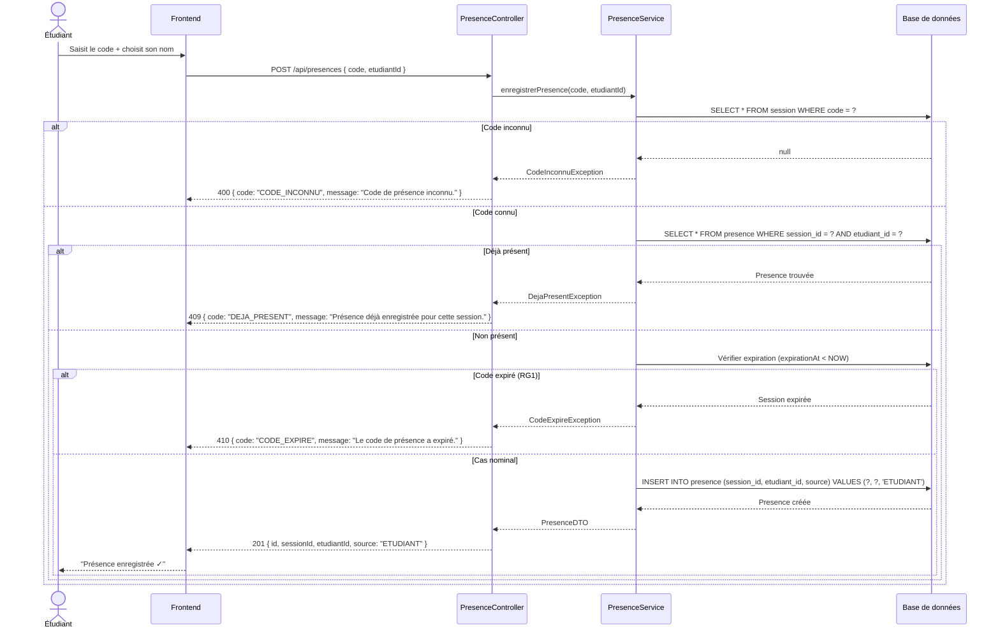

# D3 — Séquence : Marquer sa présence

```mermaid
sequenceDiagram
    actor E as Étudiant
    participant F as Frontend
    participant API as PresenceController
    participant S as PresenceService
    participant DB as Base de données

    E->>F: Saisit le code + choisit son nom
    F->>API: POST /api/presences { code, etudiantId }
    API->>S: enregistrerPresence(code, etudiantId)
    S->>DB: SELECT * FROM session WHERE code = ?
    alt Code inconnu
        DB-->>S: null
        S-->>API: CodeInconnuException
        API-->>F: 400 { code: "CODE_INCONNU", message: "Code de présence inconnu." }
    else Code connu
        S->>DB: SELECT * FROM presence WHERE session_id = ? AND etudiant_id = ?
        alt Déjà présent
            DB-->>S: Presence trouvée
            S-->>API: DejaPresentException
            API-->>F: 409 { code: "DEJA_PRESENT", message: "Présence déjà enregistrée pour cette session." }
        else Non présent
            S->>DB: Vérifier expiration (expirationAt < NOW)
            alt Code expiré (RG1)
                DB-->>S: Session expirée
                S-->>API: CodeExpireException
                API-->>F: 410 { code: "CODE_EXPIRE", message: "Le code de présence a expiré." }
            else Cas nominal
                S->>DB: INSERT INTO presence (session_id, etudiant_id, source) VALUES (?, ?, 'ETUDIANT')
                DB-->>S: Presence créée
                S-->>API: PresenceDTO
                API-->>F: 201 { id, sessionId, etudiantId, source: "ETUDIANT" }
                F-->>E: "Présence enregistrée ✓"
            end
        end
    end
```